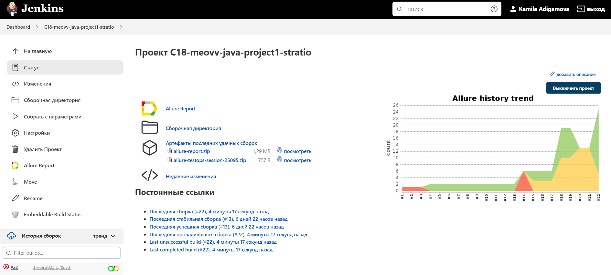
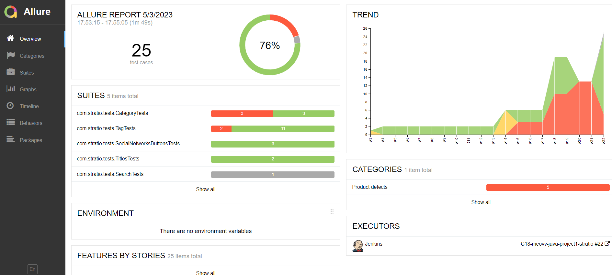
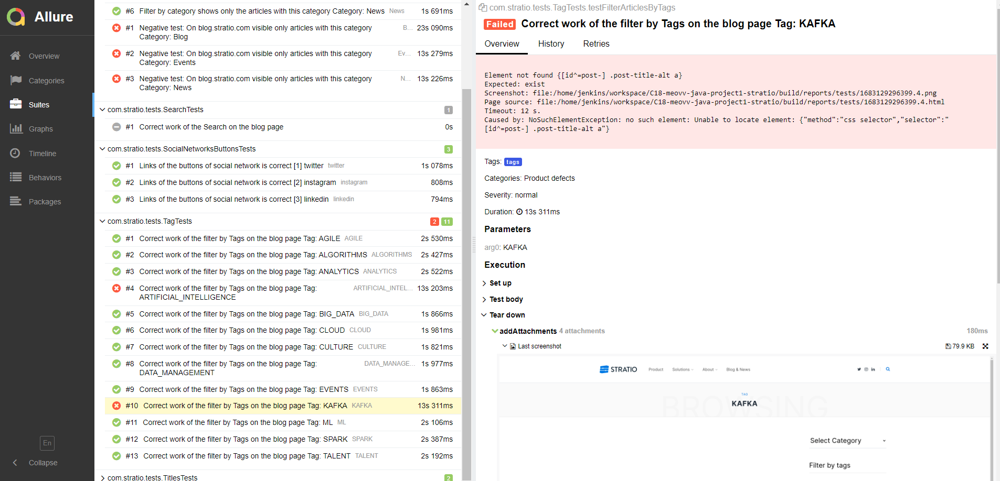
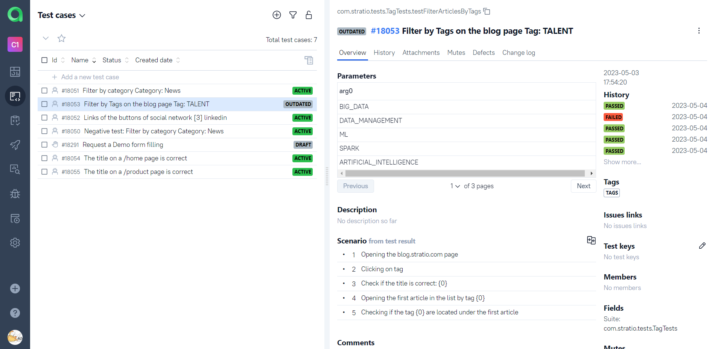
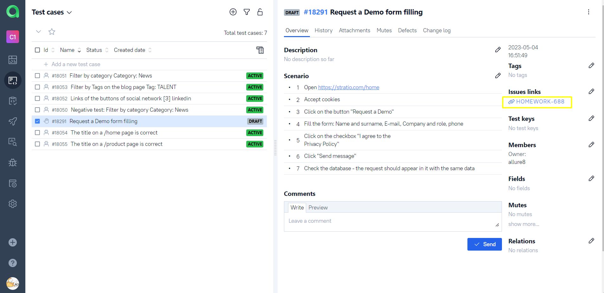
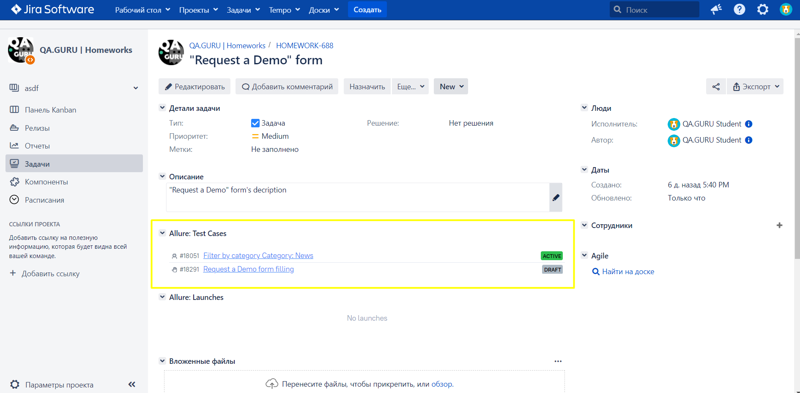
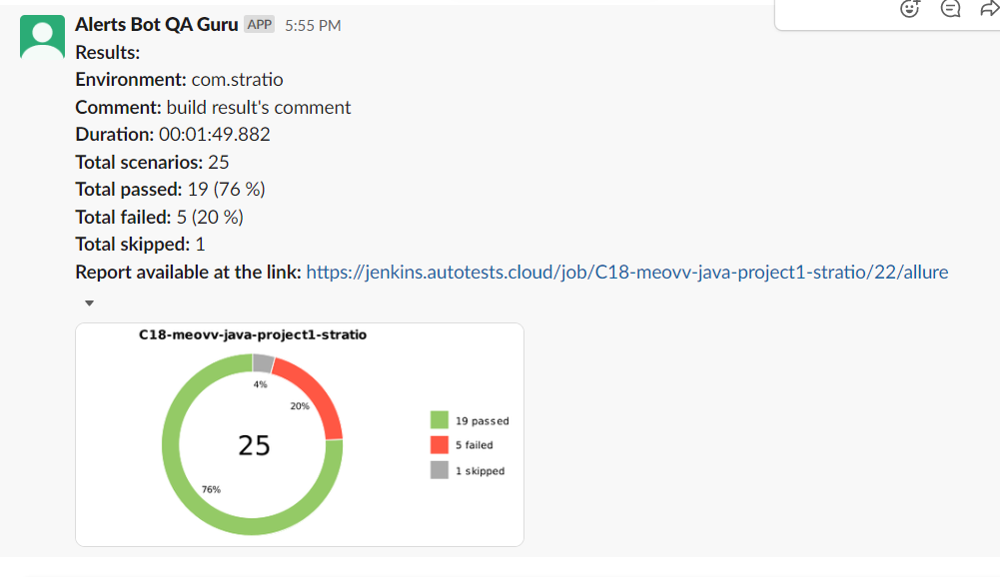
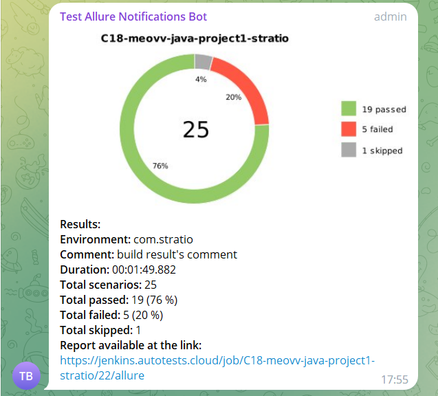

# Automated tests for the web page stratio.com
## :pushpin: Content:

- [Stack of technologies](#computer-stack-of-technologies)
- [Running tests](#running_woman-running-tests)
- [Build in Jenkins](#-build-in-jenkins)
- [Allure report example](#-allure-report-example)
- [Jira Integration](#-jira-integration)
- [Slack notifications](#-slack-notifications)
- [Telegram notifications](#-telegram-notifications)
- [Video of an example of running a test in Selenoid](#-video-example-selenoid)

## :computer: Stack of technologies

<p align="center">


</p>

Autotests are written in <code>Java</code> using <code>JUnit 5</code> and <code>Gradle</code>.
For UI tests, the [Selenide] framework (https://selenide.org/) was used.
Tests can be run locally or using [Selenoid](https://aerokube.com/selenoid/).
Also implemented build in <code>Jenkins</code> with generation of Allure-report and sending notification with results to <code>Slack</code> or <code>Telegram</code> after completion of the run. All tests are linked with <code>Jira</code> issue's keys.

**Allure report includes:**

* Test execution steps (of automated and manual tests)
* Screenshot of the last step
* Page Source
* Browser console logs
* Video of run

## :running_woman: Running tests

### Running Tests Locally
```
gradle clean test -Denv=local
```

If necessary, you can override the launch options
```
gradle clean ${TASK}
-Denv=local
-Dbrowser_name=${BROWSER}
-Dbrowser_version=${BROWSERVERSION}
-Dscreen_resolution=${BROWSER_SIZE}
```

### Running tests on a remote browser
```
gradle clean test -Denv=remote
```
You can also override launch options if needed.

```
gradle clean ${TASK}
-Dremote_browser=${REMOTEBROWSER}
-Dbrowser_name=${BROWSER}
-Dbrowser_version=${BROWSERVERSION}
-Dscreen_resolution=${BROWSER_SIZE}

```

### Build options

* <code>TASK</code> it's the name of the task. The default is <code>test</code> to run all of them.
* <code>REMOTEBROWSER</code> is the address of the remote server where the tests will run.
* <code>BROWSER</code> is the browser in which the tests will be run. The default is <code>chrome</code>.
* <code>BROWSERVERSION</code> is the browser version in which the tests will be run. The default is <code>100.00</code>.
* <code>BROWSER_SIZE</code> is the size of the browser window in which tests will be run.

##  Build in Jenkins
<p align="center">

</p>

##  Allure reports
### Overview

<p align="center">

</p>

### Test result

<p align="center">

</p>

Also we can connect <code>Jenkins</code> to the commercial version of <code>Allure</code>, which provides an opportunity to add there manual tests as well as an automated ones:

<p align="center">

</p>

<p align="center">

</p>

##  Jira Integration

And also we can see from <code>Jira</code>, which tests been added to <code>Allure</code> with their statuses

<p align="center">

</p>

###  Slack notifications

<code>Slack</code> notification of test run
<p align="center">

</p>

###  Telegram notifications

<code>Telegram</code> notification of test run
<p align="center">

</p>

###  Video of an example of running a test in Selenoid

A video is attached to each test in the report. One of these videos is shown below.
<p align="center">
  
</p>