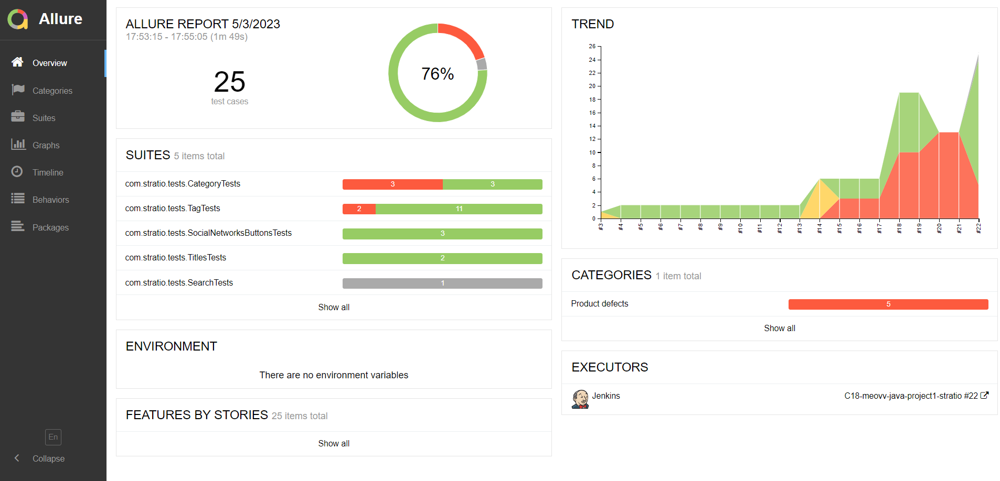

# Automated tests for the web page stratio.com
## :pushpin: Content:

- [Stack of technologies](#computer-stack-of-technologies)
- [Running tests](#running_woman-running-tests)
- [Build in Jenkins](#-build-in-jenkins)
- [Allure report example](#-allure-report-example)
- [Slack notifications](#-slack-notifications)
- [Telegram notifications](#-telegram-notifications)
- [Video of an example of running a test in Selenoid](#-video-of-an-example-of-running-a-test-in-selenoid)

## :computer: Stack of technologies

<p align="center">


</p>

Autotests are written in <code>Java</code> using <code>JUnit 5</code> and <code>Gradle</code>.
For UI tests, the [Selenide] framework (https://selenide.org/) was used.
Tests can be run locally or using [Selenoid](https://aerokube.com/selenoid/).
Also implemented build in <code>Jenkins</code> with generation of Allure-report and sending notification with results to <code>Slack</code> or <code>Telegram</code> after completion of the run.

Allure report includes:
* test execution steps;
* screenshot of the page in the browser at the end of the autotest;
* Page Source;
* browser console logs;
* video of the autotest.

## :running_woman: Running tests

### Running Tests Locally
```
gradle clean test -Denv=local
```

If necessary, you can override the launch options
```
gradle clean test
-Denv=local
-Dbrowser=${BROWSER_NAME}
-DbrowserVersion=${BROWSER_VERSION}
-DbrowserSize=${BROWSER_SIZE}
-DbaseUrl=${BASE_URL}
```

### Run tests on a remote browser
```
gradle clean test -Denv=remote
```
You can also override launch options if needed.

```
gradle clean test -Denv=remote
-Dbrowser=${BROWSER_NAME}
-DbrowserMersion=${BROWSER_VERSION}
-DbrowserSize=${BROWSER_SIZE}
-DbaseUrl=${BASE_URL}
-DremoteUrl=${REMOTE_BROWSER_URL}
```

### Build options

* <code>BROWSER_NAME</code> is the browser in which the tests will be run. The default is <code>chrome</code>.
* <code>BROWSER_VERSION</code> is the browser version in which the tests will be run. The default is <code>105.0</code>.
* <code>BROWSER_SIZE</code> is the size of the browser window in which tests will be run.
* <code>BASE_URL</code> – Url that will open the tested application. The default is <code>1920x1080</code>.
* <code>REMOTE_BROWSER_URL</code> is the address of the remote server where the tests will run.

##  Build in Jenkins
<p align="center">

</p>

##  Allure report example
### Overview

<p align="center">

</p>

### Test result

<p align="center">

</p>

###  Slack notifications

After the build is completed, a special bots created in <code>Slack</code> and <code>Telegram</code> automatically processes and sends a message with a run report.
<p align="center">

</p>

###  Telegram notifications

After the build is completed, a special bots created in <code>Slack</code> and <code>Telegram</code> automatically processes and sends a message with a run report.
<p align="center">

</p>

###  Video of an example of running a test in Selenoid

A video is attached to each test in the report. One of these videos is shown below.
<p align="center">
  
</p>